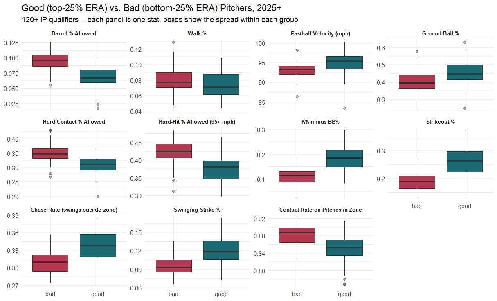
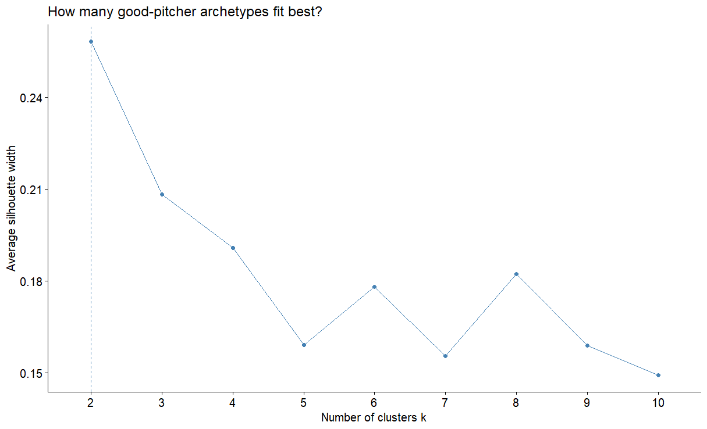
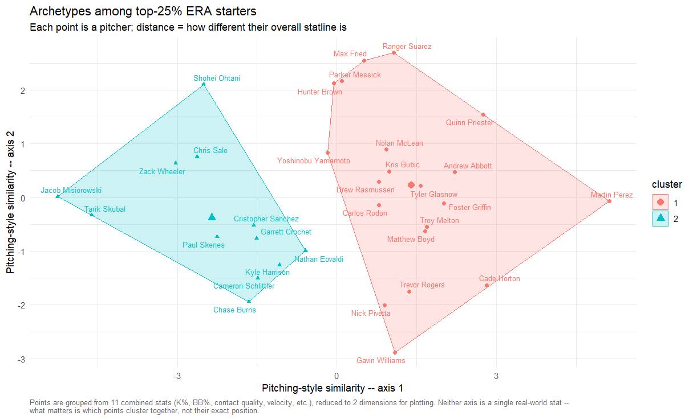
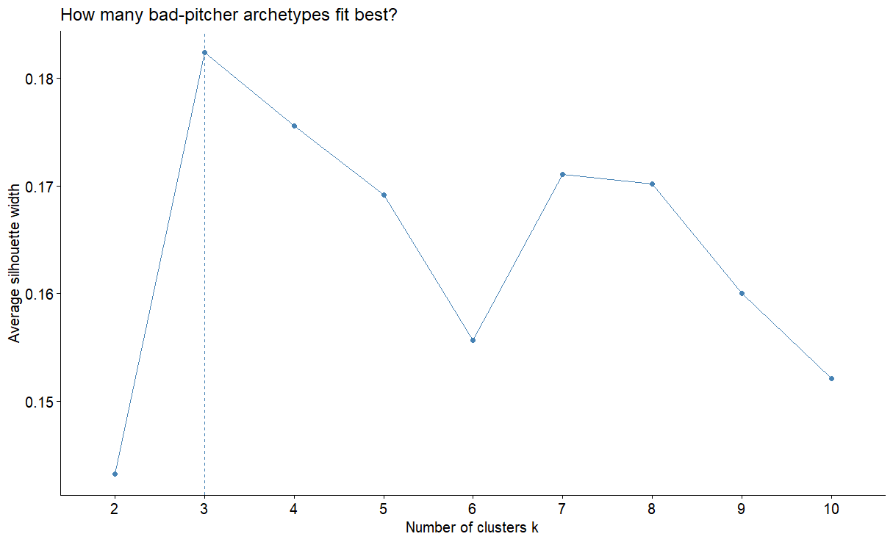
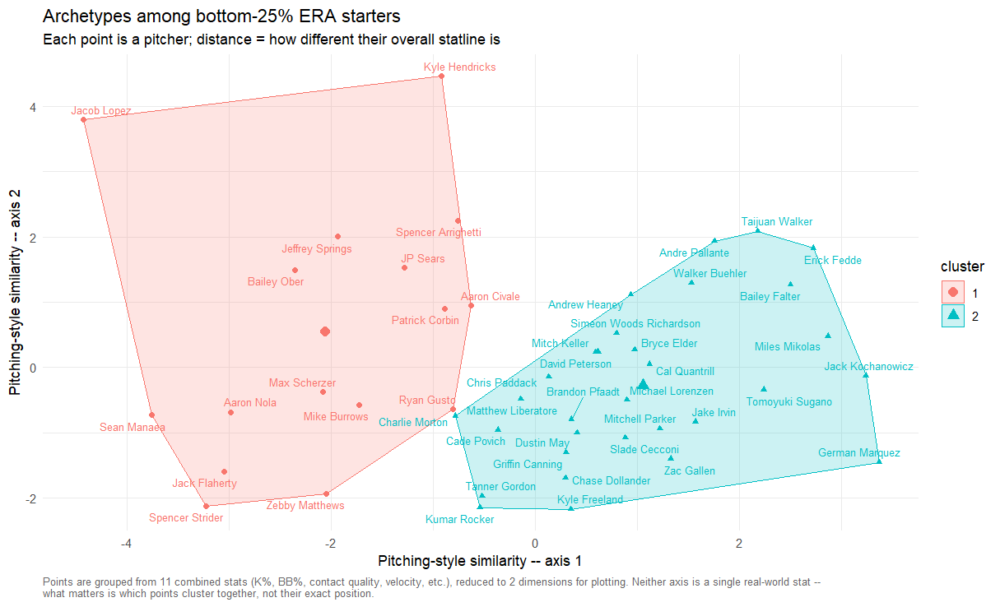
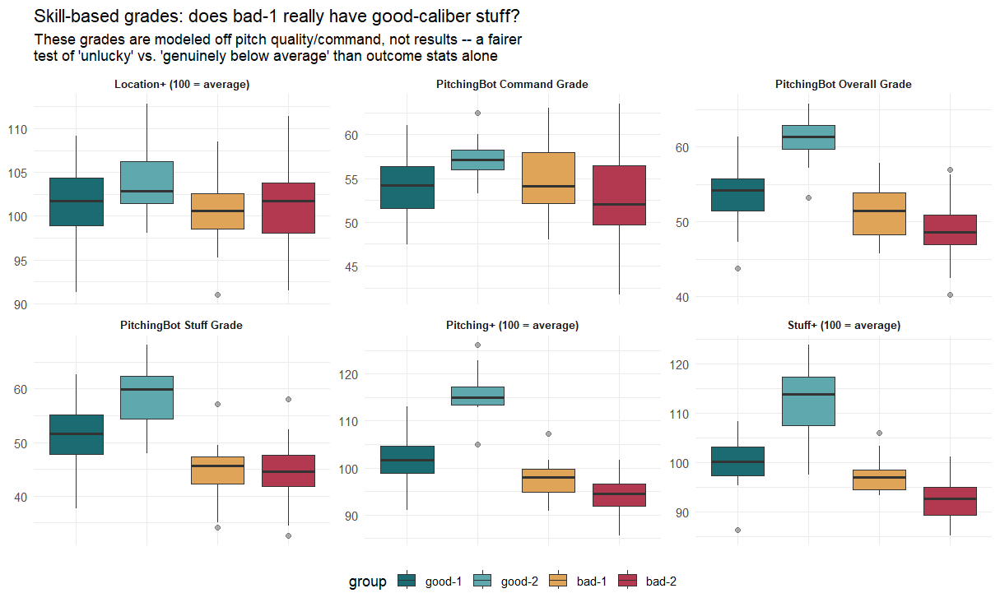
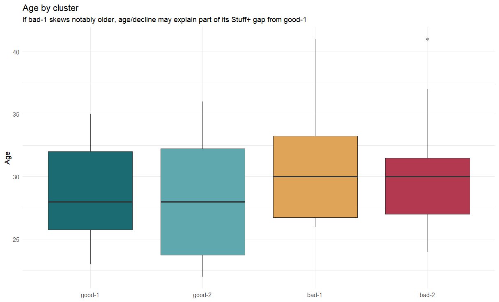
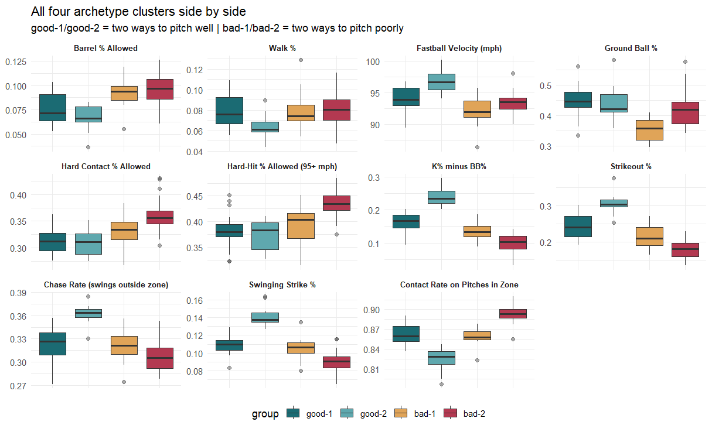

# ERA Lies: What Actually Separates Good Pitchers from Bad Ones in 2025-26

A recent Foolish Baseball video split MLB starters into a "good" group (top 25% by ERA) and a "bad" group (bottom 25%), among the 152+ pitchers with at least 120 innings pitched since 2025. The video was framed around a different question entirely — how the Brewers' contact-heavy offense performs against each tier — but it left an obvious follow-up sitting on the table: **what do the pitchers in each tier actually have in common?**

The short answer turned out to be more interesting than "good pitchers are just better." ERA, it turns out, is quietly blending together at least two different kinds of success and two different kinds of failure — and untangling them changes how you'd evaluate a struggling starter.

## Setup

Using FanGraphs' pitching leaderboard for the 2025–26 window (120+ IP), pitchers were split into ERA quartiles — top 25% ("good"), bottom 25% ("bad"), and a middle 50% set aside for this analysis. Relievers were excluded from the clustering (a handful of funk/submarine specialists have such unusual profiles that they distort the geometry for everyone else) and each tier's starters were run through k-means clustering across eleven core metrics: strikeout rate, walk rate, K-BB%, swinging-strike rate, chase rate, in-zone contact rate, hard-contact rate, barrel rate, hard-hit rate, ground-ball rate, and fastball velocity.

## Finding 1: K% Minus BB% Is the Cleanest Single Signal — But It's Not the Whole Story

Of every stat tested, K-BB% showed the least overlap between the good and bad tiers. Good-tier pitchers cluster around 20%+, while bad-tier pitchers mostly sit under 15%. A logistic regression confirmed it: after controlling for every other variable, K-BB% was the only statistically significant predictor of landing in the good tier (p = 0.007). Velocity and ground-ball rate were marginal at best (p ≈ 0.08–0.10); everything else — chase rate, swinging-strike rate, contact quality — washed out once K-BB% was in the model.

That's a clean headline. It's also incomplete, as the next two findings show.

## Finding 2: There Are Two Legitimate Ways to Pitch Well

Clustering the good-tier starters found two distinct, statistically sound archetypes rather than one uniform "good pitcher" profile:

The silhouette analysis above pointed clearly to two clusters:

**The Power/Whiff Group** — headlined by names like Skenes, Skubal, Crochet, and Sale — succeeds through swing-and-miss: elite velocity (~96–97 mph average fastball), the highest K-BB% of any cluster (~24%), and the lowest in-zone contact rate. They generate outs by simply not letting the ball get put in play.

**The Command/Contact-Management Group** — Suárez, Fried, Brown, and others — runs lower velocity (~93–94 mph) and a lower K-BB% (~16%), but compensates with a wider pitch mix and better-managed contact quality.

The genuinely interesting part: **once contact happens, both groups allow almost identical hard-contact and barrel rates.** The power group avoids damage by minimizing balls in play; the command group avoids damage by managing the quality of contact when it does occur. Two different mechanisms converging on the same outcome.

## Finding 3: "Bad" Pitching Isn't One Thing Either — But It's Also Not Simply Bad Luck

This is where the analysis earns its keep. Clustering the bad-tier starters also produced two groups, and the gap between them is the real story:

**Cluster A** (Hendricks, Nola, Scherzer, Flaherty, Ober, and others) posted noticeably better K-BB%, lower hard-contact rates, and lower barrel rates than **Cluster B** (Walker, Buehler, Fedde, Mikolas, and others) — close enough to the good-tier clusters on outcome stats that the obvious first read is "these guys just got unlucky."

That read doesn't fully survive a closer look. Pulling in Stuff+, Location+, and PitchingBot's proprietary grades — models built from pitch characteristics and location rather than results — tells a more layered story:

- **Command and location are essentially flat across all four clusters.** Cluster A's command grade was, if anything, slightly *higher* than the good-command cluster's. Command is not what separates good pitching from bad pitching in this dataset.
- **Stuff+ cleanly orders all four groups: power-good (113) > command-good (100) > Cluster A (97) > Cluster B (92).** Cluster A's raw stuff trails the good clusters — modestly, not collapsed to Cluster B's level, but a real and consistent gap.
- **That gap holds pitch-by-pitch.** Breaking Stuff+ out by individual pitch type (fastball, slider, changeup, curveball) shows Cluster A trailing the command-good cluster by a similar margin across the entire arsenal — not concentrated in one fixable pitch.

- **Age doesn't explain it.** The correlation between age and Stuff+ within Cluster A was effectively zero (-0.06). Twenty-six-year-olds and forty-one-year-olds in this cluster graded out similarly below-average on raw stuff; it isn't a decline story.

The honest conclusion: Cluster A pitchers generate solid strikeout-to-walk numbers through precision and sequencing, but their underlying stuff has less margin for error than the good-tier clusters'. A well-located pitch from a below-average arsenal still gets hit hard more often than a well-located pitch from an above-average one. Their bad ERA isn't pure noise — but it also isn't simply "genuinely bad pitcher," the way Cluster B's profile (below-average on everything: command, stuff, contact management) actually is.

## Four Archetypes, Not Two Tiers

| Archetype | Defining Trait | How They Win/Lose |
|---|---|---|
| **Power-Good** | Elite stuff, elite K-BB% | Wins by avoiding contact entirely |
| **Command-Good** | Above-average stuff, plus command | Wins by managing contact quality |
| **Command-Bad** | Good command, below-average stuff | Command keeps them competitive, but limited margin for error on mistakes |
| **True-Bad** | Below-average command *and* stuff | Missing both levers |

## Caveats

This is a single-season, cross-sectional analysis of publicly available leaderboard data — it identifies correlations and clean statistical groupings, not causal mechanisms. A few things it can't answer:

- Whether Command-Bad's modest outcome-stat overperformance relative to their stuff grades comes from schedule strength, park effects, or plain variance — untangling that would require opponent-adjusted and park-adjusted data beyond what FanGraphs' public leaderboards provide.
- Whether any specific mechanical or pitch-design change would actually move a pitcher's Stuff+ grade — that's a testable hypothesis worth exploring, not a finding this analysis demonstrated.
- How defense (OAA/DRS) specifically contributed to any individual pitcher's ERA — a natural next step, not covered here.

## Bottom Line

ERA alone conflates outcomes that have different underlying causes on both ends. Two pitchers can post similar ERAs for genuinely different reasons, and two struggling pitchers can be struggling for genuinely different reasons too. Before writing off — or targeting — a starter based on ERA or even K-BB% alone, it's worth checking whether their skill grades (Stuff+, Location+, or equivalent) actually back up the story the results are telling.

---
*Analysis based on FanGraphs pitching leaderboard data (2025–26, 120+ IP qualifiers). Methodology: ERA-quartile tiering, k-means clustering (k=2 per tier, selected via silhouette analysis) across eleven plate-discipline/contact-quality/velocity metrics, cross-validated against skill-based grades (Stuff+/Location+/Pitching+, PitchingBot).*
